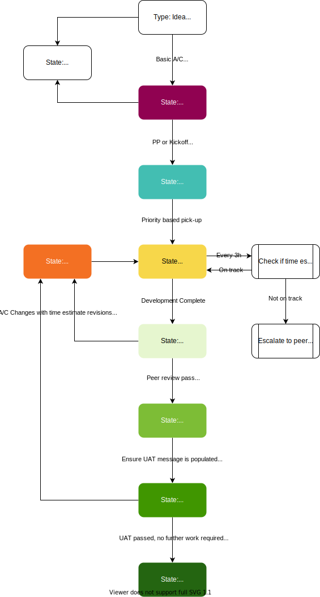

# Development

A list of resources to aid in development

* [Coding Standards & Guidelines](https://github.com/vivait/coding-standards-guidelines)

## Process Map

The diagram below explains at a basic level the overall flow of development work through the entire process.

## Languages, Tools, Platforms, Frameworks:

The following list might seem a little buzzword-y, but it's just a list of some of the things in our tech stack that will be good to know.

* PHP
* MySQL
* JavaScript (TypeScript)
* SASS
* Symfony
* Doctrine
* ElasticSearch
* AWS (EC2, RDS, Aurora, ECS, Fargate, SSM, Lambda)
* Docker (previously Vagrant & Ansible)
* PhpStorm - PHP IDE of choice for most developers here
* PHPUnit
* SequelPro

